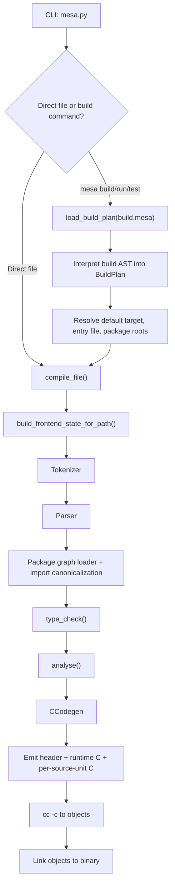
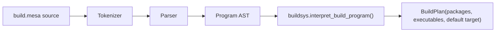
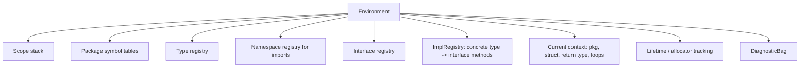
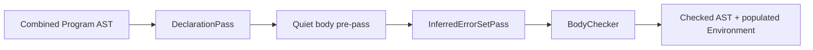
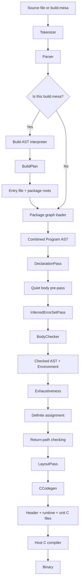

# Mesa Compiler Pipeline Walkthrough

This document explains the compiler as it exists in this repository, from raw source text through tokenization, parsing, package loading, type checking, analysis, C emission, and final linking.

The goal is not just to say "what happens", but to explain the data structures, invariants, and pass boundaries well enough that you could reimplement the compiler in another language.

It also covers `build.mesa`, because in this codebase the build file is not compiled like a normal Mesa program. It is tokenized and parsed with the normal frontend, then interpreted by a separate restricted build-system evaluator.

## 1. The Big Picture

There are really two related pipelines:

1. The normal program pipeline.
2. The `build.mesa` pipeline that decides which program to compile and with which package roots.

The top-level CLI entry is [`mesa.py`](/Users/oppenheimer/mesa_MVP/mesa2/mesa.py).

The build path is not just a wrapper around the normal compiler. It is its own interpreter:

That distinction matters:

- Normal Mesa sources go through lexing, parsing, package loading, type checking, analysis, and code generation.
- `build.mesa` only goes through lexing, parsing, and a custom AST interpreter in [`src/buildsys.py`](/Users/oppenheimer/mesa_MVP/mesa2/src/buildsys.py).

## 2. The Core Intermediate Forms

If you reimplement this compiler, think of it as a sequence of representations:

1. Source text
2. Token stream
3. Surface AST
4. Combined package AST
5. Resolved type graph + symbol environment
6. Checked AST annotated with inferred/resolved types
7. Layout metadata
8. Generated C translation units
9. Object files
10. Final binary

The key modules are:

- [`src/tokenizer.py`](/Users/oppenheimer/mesa_MVP/mesa2/src/tokenizer.py): source -> tokens
- [`src/parser.py`](/Users/oppenheimer/mesa_MVP/mesa2/src/parser.py): tokens -> AST
- [`src/ast.py`](/Users/oppenheimer/mesa_MVP/mesa2/src/ast.py): surface syntax node definitions
- [`src/frontend.py`](/Users/oppenheimer/mesa_MVP/mesa2/src/frontend.py): package loading, import resolution, combined frontend state
- [`src/types.py`](/Users/oppenheimer/mesa_MVP/mesa2/src/types.py): internal semantic type model
- [`src/env.py`](/Users/oppenheimer/mesa_MVP/mesa2/src/env.py): scopes, symbol tables, type registries, diagnostics
- [`src/checker.py`](/Users/oppenheimer/mesa_MVP/mesa2/src/checker.py): semantic checking
- [`src/analysis.py`](/Users/oppenheimer/mesa_MVP/mesa2/src/analysis.py): post-check analyses and layout
- [`src/ccodegen.py`](/Users/oppenheimer/mesa_MVP/mesa2/src/ccodegen.py): checked AST -> C
- [`src/buildsys.py`](/Users/oppenheimer/mesa_MVP/mesa2/src/buildsys.py): `build.mesa` interpreter

## 3. CLI Control Flow

The CLI in [`mesa.py`](/Users/oppenheimer/mesa_MVP/mesa2/mesa.py) has two user-facing modes:

- Legacy direct compilation:
  - `mesa file.mesa`
  - `mesa file.mesa --emit-c`
  - `mesa file.mesa --check`
- Build-system commands:
  - `mesa init`
  - `mesa build`
  - `mesa run`
  - `mesa test`
  - `mesa pkg add`

### Direct-file path

`compile_file()` does this:

1. Read source.
2. Call `build_frontend_state_for_path()`.
3. Abort on token/parse/type errors.
4. Run `analyse()`.
5. Feed the resulting `Program`, `Environment`, and `LayoutPass` into `CCodegen`.
6. Either print/write the generated C, or compile and link it with the system C compiler.

### Build-command path

`mesa build` and `mesa run` do this:

1. Find `./build.mesa`.
2. Parse it with `load_build_plan()`.
3. Interpret its AST into a `BuildPlan`.
4. Extract the default executable target.
5. Convert the target's declared package roots into `(path, public_name)` pairs.
6. Call `compile_file()` on the executable entry file, passing those package roots.

The build layer therefore decides:

- which entry file is the root source,
- which packages are importable,
- which target name becomes the output path.

## 4. Tokenization

The tokenizer lives in [`src/tokenizer.py`](/Users/oppenheimer/mesa_MVP/mesa2/src/tokenizer.py).

### 4.1 Token model

Each token is:

- `kind`: enum member from `TK`
- `lexeme`: original source substring
- `line`, `col`: source location

The token kinds are intentionally broad. They include:

- literals: `INT`, `FLOAT`, `STRING`, `MULTILINE`, `TRUE`, `FALSE`, `NONE`
- declaration keywords: `fun`, `struct`, `union`, `interface`, `type`, `pkg`, `pub`, `export`, `opaque`, `extern`, `inline`
- control-flow keywords: `if`, `else`, `for`, `while`, `match`, `return`, `break`, `continue`, `with`
- error-handling keywords: `try`, `catch`, `handle`, `orelse`, `defer`, `esc`
- primitive type tokens: `TY_I64`, `TY_F64`, and so on
- operators: arithmetic, assignment, comparison, broadcast operators, optional operators
- punctuation and delimiters
- a virtual `NEWLINE` token inserted after lexing

### 4.2 Two-pass newline handling

The tokenizer does something important that a naive lexer would miss: it turns physical newlines into logical statement separators only when appropriate.

Algorithm:

1. First pass:
   - scan raw tokens,
   - remember whether there was a real newline before each token.
2. Second pass:
   - insert synthetic `NEWLINE` tokens only when:
     - the previous token can end a statement,
     - the next token is not a continuation starter,
     - the parser is not inside parens, brackets, or value-braces like `.{ ... }`.

This gives Mesa semicolon-light syntax without making line breaks always significant.

If you reimplement this, do not treat every newline as a token. Track:

- statement-ending tokens
- continuation-leading tokens
- delimiter nesting

That is the real rule.

### 4.3 Special lexer behaviors

The tokenizer also directly understands:

- `//` single-line comments
- `\\` multiline string/comment blocks
- number bases: decimal, hex, binary, octal
- broadcast operators like `.*`, `.+`, `.==`
- range operators `..` and `...`
- optional operators `?.` and `?=`
- unit expressions in backticks, producing a `UNIT` token
- attribute start `#[`

The parser later gives semantic meaning to many of these, but the tokenizer decides the lexical boundaries.

## 5. Parsing

The parser in [`src/parser.py`](/Users/oppenheimer/mesa_MVP/mesa2/src/parser.py) is a handwritten recursive-descent parser with precedence climbing for infix expressions.

### 5.1 The AST it builds

The surface AST definitions live in [`src/ast.py`](/Users/oppenheimer/mesa_MVP/mesa2/src/ast.py). There are several categories:

- type-expression nodes:
  - `TyPrimitive`, `TyNamed`, `TyPointer`, `TyOptional`, `TyErrorUnion`, `TyTuple`, `TyFun`, `TyAnyInterface`, etc.
- expression nodes:
  - literals, identifiers, `BinExpr`, `UnaryExpr`, `FieldExpr`, `CallExpr`, `TupleLit`, `VecLit`, `IfExpr`, `MatchExpr`, `WithExpr`, `Closure`, `EscExpr`, `WithAllocExpr`, `UnitLit`, `UncertainLit`
- statement nodes:
  - `LetStmt`, `ReturnStmt`, `AssignStmt`, loop statements, `DeferStmt`, `ExprStmt`
- declaration nodes:
  - `FunDecl`, `StructDecl`, `UnionDecl`, `InterfaceDecl`, `DefDecl`, `TypeAlias`, `ErrorDecl`, import declarations, package export declarations, `TestDecl`
- top-level `Program`

This AST is still surface syntax. It is not the final semantic representation.

### 5.2 Parser architecture

Top-level flow:

1. Optional `pkg` declaration first.
2. Then a loop of declarations until EOF.

Expression parsing uses precedence climbing:

- `_parse_expr()`
- `_prec(min_prec)`
- `_parse_unary()`
- `_parse_postfix_chain()`
- `_parse_primary()`

The operator precedence table is explicit in `_PREC`.

### 5.3 Important parser rewrites

The parser does more than just mirror syntax 1:1. It rewrites some constructs into synthetic helper calls or normalized forms:

- `try expr` becomes `CallExpr(Ident("__try"), ...)`
- `expr orelse fallback` becomes `CallExpr(Ident("__orelse"), ...)`
- `expr catch { ... }` becomes `CallExpr(Ident("__catch" or "__catch_bind"), ...)`
- optional chains use `__optional_chain`
- suffix ternary-style `value if cond` becomes an `IfExpr` with `none` as the else branch

That is a useful design choice for a reimplementation:

- keep the parser simple,
- encode desugaring early,
- let the checker and code generator handle a smaller set of normalized constructs.

### 5.4 Parsing strategy for blocks

Blocks are expression-valued:

- `Block.stmts` contains normal statements
- `Block.tail` stores the final expression if the last thing in the block is an expression without a trailing separator

That is why the checker and code generator treat blocks as producing values, not just controlling execution.

### 5.5 Parsing `with`, `handle`, `if unwrap`, and pattern syntax

Some syntax forms worth noting:

- `with resource : .cleanup { ... } handle |e| { ... }`
- `if optional_expr |v| { ... } else { ... }`
- `while optional_expr |v| { ... }`
- `match value { .Variant(x) => ..., _ => ... }`

These are first-class nodes in the AST. They are not macro-expanded away.

## 6. Frontend Assembly and Package Loading

The parser only sees one file. The real frontend in [`src/frontend.py`](/Users/oppenheimer/mesa_MVP/mesa2/src/frontend.py) is what turns one entry file into a whole program graph.

`FrontendState` contains:

- raw source
- token list
- parsed `Program`
- populated `Environment`
- `DiagnosticBag`
- tokenization/parse errors if any

### 6.1 Why `frontend.py` exists

It handles things the parser should not:

- load imported packages
- canonicalize standard-library imports
- combine multi-file packages
- load `.pkg` facades and export surfaces
- attach source-file and package metadata to declarations
- then invoke type checking on the combined graph

### 6.2 Package roots and package identity

Mesa imports are resolved relative to a list of package roots:

- explicitly passed in from `build.mesa`
- plus the bundled standard library roots from [`src/stdlib.py`](/Users/oppenheimer/mesa_MVP/mesa2/src/stdlib.py)

Each package root is a tuple:

- `(filesystem_root, public_name_or_none)`

This lets the compiler support both:

- unnamed source roots
- named roots like `"physics" -> src/physics`

### 6.3 Multi-file package loading

When the root file declares `pkg some.name`, the frontend:

1. resolves the package root directory,
2. walks that subtree,
3. parses every `.mesa` file whose `pkg` header matches,
4. clones and annotates their declarations,
5. combines them into a single synthetic `Program`.

If the root file has no `pkg` and a `local_root` is supplied, pkg-less files under that subtree can also be combined as a target-local source set.

### 6.4 Import resolution

The import loader:

- canonicalizes bare std names like `mem` -> `std.mem`
- resolves package files or facades
- detects import cycles
- loads imported package interfaces via `.pkg` facade files
- marks imported declarations as interface-only / facade-controlled when appropriate

The `.pkg` mechanism is important:

- a package facade can export selected declarations from internal source files,
- the compiler loads those source files,
- clones only the export surface,
- and hides non-exported declarations from importers.

### 6.5 Final frontend output

At the end of `build_frontend_state_for_path()`:

1. the root program and imported package programs are combined,
2. `type_check()` is called on that combined `Program`,
3. the returned `Environment` and diagnostics are stored in the `FrontendState`.

So the real semantic input is not "the AST of one file". It is "one combined package graph AST".

## 7. Internal Type System

The semantic type model is in [`src/types.py`](/Users/oppenheimer/mesa_MVP/mesa2/src/types.py). This is separate from the parser's `TypeExpr` nodes.

That split is essential.

### 7.1 Why there are two type representations

The AST types describe source syntax:

- `TyNamed("Vec3")`
- `TyOptional(TyPrimitive("i64"))`

The checker types describe resolved meaning:

- `TStruct(name="Vec3", ...)`
- `TOptional(T_I64)`

If you reimplement this compiler, keep those layers separate.

### 7.2 Major semantic types

The important semantic type classes are:

- primitive-like:
  - `TInt`, `TFloat`, `TBool`, `TString`, `TVoid`
- inference helpers:
  - `TIntLit`, `TFloatLit`, `TVar`, `TError`
- composites:
  - `TOptional`, `TPointer`, `TSlice`, `TArray`, `TVec`, `TMat`, `TTuple`, `TFun`
- named user types:
  - `TStruct`, `TUnion`, `TInterface`, `TNamespace`
- error model:
  - `TErrorSet`, `TErrorSetUnion`, `TErrorUnion`
- advanced value models:
  - `TUnitful`, `TUncertain`, `TAnyInterface`, `TDynInterface`

### 7.3 Unification and assignability

Two key operations drive the checker:

- `is_assignable(src, dst)`
- `unify(a, b)`

`is_assignable` handles one-way compatibility, such as:

- integer literal -> integer/float
- `T` -> `?T`
- error-set subset relationships

`unify` handles symmetric merge logic, such as:

- resolving `TVar`
- widening numeric types
- merging optional inner types
- merging compatible function types
- combining error-set unions

If the compiler had one semantic center, this is it. Most checker decisions eventually reduce to assignment or unification.

### 7.4 Units, uncertainty, and interfaces

Mesa's type layer is not minimal. It also models:

- dimensional units via a 7-axis SI exponent vector
- uncertain values
- existential interfaces:
  - `any Interface` as stack existential with small-buffer optimization
  - `*any Interface` as heap fat pointer

This is why codegen needs more than simple primitive lowering.

## 8. `env.py`: The Semantic Backbone

[`src/env.py`](/Users/oppenheimer/mesa_MVP/mesa2/src/env.py) is the compiler's semantic backbone. It does not "check programs" by itself, but it stores almost everything the checker needs.

### 8.1 Diagnostics

`DiagnosticBag` collects:

- errors
- warnings
- notes
- related source spans

It also deduplicates diagnostics structurally, so repeated traversals do not spam identical messages.

### 8.2 Symbols and scopes

A `Symbol` stores:

- name
- semantic type
- mutability
- source position
- lifetime region metadata
- package path
- C symbol name
- pointer back to the declaration node for functions

`Scope` is a single lexical scope. `Environment` maintains a stack of scopes for normal bindings and a parallel loop stack for `break` / `continue` handling.

### 8.3 Registries inside `Environment`

The environment is much more than a local variable stack. It stores:

- `_scopes`: lexical variables
- `_types`: globally known semantic types
- `_pkg_symbols`: package-level value symbols
- `_pkg_types`: package-level type symbols
- `_interfaces`: registered interfaces
- namespace tables for imported package members
- the implementation registry (`impls`)
- current return type
- current struct and package
- allocator/lifetime stacks
- unit registry

Conceptually:

### 8.4 `ImplRegistry`

This is the answer to "how do interfaces and operators actually work?"

`ImplRegistry` maps:

- `(concrete_type_name, interface_name)` -> method table

The checker uses that registry to answer questions like:

- does `Vec3` implement `Add`?
- if `Vec3` implements `Add`, what is the type of method `add`?
- can the `+` operator be resolved through an interface impl?

That is why operator overloading works without hardcoding every user type into the checker.

## 9. Type Checking Overview

The main checker is [`src/checker.py`](/Users/oppenheimer/mesa_MVP/mesa2/src/checker.py).

The architecture is pass-based:

The pass ordering matters a lot.

## 10. Declaration Pass

`DeclarationPass` exists so the compiler can know all names before checking bodies.

That enables:

- mutual recursion
- methods referring to their containing types
- interface impl registration before body checking
- package namespace export tables

### 10.1 What it registers

It walks the declarations in package-grouped order and registers:

- builtins like `println`, `len`, `@assert`, allocator intrinsics, and `@test.*`
- imported namespaces and imported names
- interfaces first
- then structs/unions/aliases/errors
- then function signatures and `def` methods

It intentionally does **not** type-check function bodies here.

### 10.2 Struct registration strategy

For a struct, the pass:

1. creates an initially skeletal `TStruct`,
2. registers it immediately so self-references work,
3. lowers field types,
4. lowers method types,
5. registers methods both inside the struct type and as callable symbols such as `StructName.method`.

That "register shell first, fill later" pattern is standard compiler engineering and worth copying.

### 10.3 Imports and package namespace exposure

The pass also handles package visibility:

- `pub` items become namespace-exportable
- private items are tracked as hidden
- facade-controlled package exports can rename or expose opaque views of types

That is how imported packages can see public API without seeing all implementation details.

## 11. Body Checking

`BodyChecker` is where most semantic work happens.

Its style is bidirectional:

- `_synth_expr(expr)` infers a type bottom-up
- `_check_expr(expr, expected)` verifies an expression against an expected type top-down

This is the right choice for a language with:

- literals that need contextual typing
- closures
- tuple and struct literals
- optional and error-union coercions
- generic calls

### 11.1 Why bidirectional typing matters here

Example:

- literal `42` by itself should be `{integer}`
- but in a context expecting `f64`, it should check as `f64`

If you only synthesize types bottom-up, you either lose context or need ad hoc coercion everywhere. Bidirectional checking keeps those rules centralized.

### 11.2 Function-body algorithm

For each function body:

1. push a new scope
2. register generic type params as `TVar`
3. compute the effective return type
4. bind parameters
5. check the body block against that return type
6. if a function-level `handle` block exists, check it in a scope containing the error binding
7. pop scope and restore context

### 11.3 Expression families the checker handles specially

The checker has dedicated logic for:

- literals
- tuple and struct literals
- vec literals and comprehensions
- `if`, `if unwrap`, `match`, `while unwrap`
- `with` expressions and local `handle`
- `esc`
- `none`
- field access and method lookup
- variant constructors
- calls, including generic instantiation
- unit arithmetic
- uncertainty arithmetic
- interface coercions
- special intrinsics and parser-generated helper calls

### 11.4 How `with`, `try`, and `esc` work semantically

This is one of the more advanced parts of the compiler.

The checker tracks allocator/lifetime regions:

- entering a cleanup-bearing `with` creates a region
- values can carry a `_lifetime_region`
- assignments and returns are checked to make sure values do not outlive the cleanup scope that owns them

`try` is also context-sensitive:

- valid when the enclosing function returns an error union,
- or a function/with block has a `handle`,
- otherwise it is rejected.

`esc` means "clone/promote this value to the next outer allocator context and return it as `!T`".

That is why `env.py` and `checker.py` both have allocator-stack concepts. `env.py` stores the current allocator context; `BodyChecker` enforces the region rules.

### 11.5 How call checking works

Call checking roughly does this:

1. Handle special synthetic or intrinsic calls first.
2. Resolve variant constructors like `.Some(x)`.
3. Synthesize the callee type.
4. If the callee is a method call, account for implicit receiver passing.
5. If the call is generic, infer bindings for type variables from arguments.
6. Check each argument against the parameter type.
7. Store the resolved return type on the AST node for codegen.

That last step is crucial: codegen relies heavily on checker annotations like `_resolved_type`.

### 11.6 How operators work

Operators use a mix of hardcoded primitive logic and interface-based dispatch.

For primitive numbers and strings, some operators are built in.

For user types, the checker asks the environment:

- which interface corresponds to `+`, `-`, `*`, `/`, `==`, `<`, etc.?
- does the left operand type implement that interface?
- if yes, what is the return type of the method implementing it?

That means operator checking is conceptually just method lookup through `ImplRegistry`.

## 12. Inferred Error-Set Pass

Mesa supports return types like `!T` where the concrete error set is inferred.

That logic is isolated in `InferredErrorSetPass`.

Its job is:

1. find functions returning `TyErrorUnion` with no explicit error set,
2. walk their bodies collecting:
   - propagated `try` errors,
   - returned error values,
   - `esc` effects,
3. merge those into a concrete `TErrorSet` or `TErrorSetUnion`,
4. update the function's effective return type,
5. repeat to a fixed point because functions can depend on each other.

This is a separate pass because you cannot always know a function's final error set during the initial declaration pass.

## 13. Post-Type-Check Analysis

After checking, [`src/analysis.py`](/Users/oppenheimer/mesa_MVP/mesa2/src/analysis.py) runs four analysis passes.

### 13.1 Exhaustiveness

Ensures:

- `match` over unions/errors covers all variants or has `_`
- `match` over `bool` covers both `true` and `false`
- integer matches have a wildcard/binding because the domain is open-ended

### 13.2 Definite assignment

Tracks which names are definitely assigned at each point.

At branch joins:

- a name is definitely assigned after the branch only if all paths assign it

This is a simple but effective forward dataflow pass.

### 13.3 Return-path checking

Ensures non-void functions return on all paths.

This pass reasons structurally over blocks, `if`, and `match` rather than building a general CFG.

### 13.4 Layout pass

This pass computes:

- size
- alignment
- field offsets

for semantic types.

`CCodegen` needs those results for:

- struct field layout
- union payload layout
- optional layout
- allocation sizes
- interface SBO decisions

Conceptually, type checking answers "is this legal?" and layout answers "how many bytes does it occupy and where?"

## 14. Code Generation to C

The active backend is [`src/ccodegen.py`](/Users/oppenheimer/mesa_MVP/mesa2/src/ccodegen.py).

It emits C99, not assembly and not machine code directly.

### 14.1 Why the backend is large

It is not just printing expressions. It must model:

- Mesa runtime helper types
- optional values
- vectors
- result structs for error unions
- interface vtables
- small-buffer `any Interface`
- dynamic fat-pointer `*any Interface`
- cleanup scopes
- promoted `esc` values
- monomorphized generic functions
- test runtime support

### 14.2 Output structure

The CLI does not emit one monolithic C file when building a binary. It emits:

1. a shared support header
2. a runtime-state C file
3. one C file per original source file group
4. for tests, a generated test runner C file

Then it compiles each to an object and links them.

That is why [`mesa.py`](/Users/oppenheimer/mesa_MVP/mesa2/mesa.py) has:

- `_group_program_by_source_file()`
- `emit_support_header()`
- `emit_runtime_state_source()`
- `emit_unit_source()`

### 14.3 The codegen phases

Within `CCodegen`, the main top-level sequence is:

1. emit C preamble/runtime declarations
2. emit type declarations
3. pre-scan generic instantiations
4. emit forward declarations
5. emit normal declarations/functions
6. emit monomorphized generic bodies

### 14.4 Semantic annotations codegen relies on

Codegen relies on checker-written annotations on AST nodes, including:

- `_resolved_type`
- `_pre_coerce_type`
- `_bound_symbol`
- `_binding_type`
- `_lifetime_region`
- `_c_name`
- `_is_entrypoint`

That means the code generator is not independently re-deriving types. It expects the checker to have already solved them.

### 14.5 Runtime representation choices

Examples:

- `str` -> `mesa_str { const char* data; int64_t len; }`
- `?T` -> generated `mesa_opt_<T>`
- `vec[T]` -> generated `mesa_vec_<T>`
- `E!T` -> generated `Mesa_result_<E>_<T>`
- error sets -> generated error object structs/tags
- `any Interface` -> stack existential with inline buffer + vtable
- `*any Interface` -> heap box with vtable + data

These are language design decisions baked into the backend. If you reimplement in another language, you can choose different layouts, but then your checker/runtime contract must change too.

### 14.6 Cleanup and control-flow emission

The backend tracks cleanup frames and loop depth so it can emit the right cleanup calls before:

- `return`
- `break`
- `continue`
- `try`-based error propagation

This mirrors the region/lifetime logic from the checker, but at code-emission time.

### 14.7 Generic function emission

Generics are implemented by monomorphization:

1. when codegen sees a generic call with concrete type bindings,
2. it queues a specialized function instance,
3. emits a mangled name for that specialization,
4. later emits the specialized function body.

This is not dictionary passing or runtime polymorphism. It is template-style specialization.

## 15. Linking Strategy

`mesa.py` uses the system C compiler as the final lowering stage.

Normal build:

1. emit C files
2. compile each with `cc -c`
3. link objects with `cc ... -lm -O2 -std=c99`

Test build:

1. lower Mesa `test` declarations into internal functions
2. generate a test-runner `main`
3. compile and link like normal
4. run the test binary

So the Mesa compiler is really:

- front end + semantic analysis + C source backend
- with the host C compiler acting as the final machine-code backend

## 16. `build.mesa` as a Restricted Interpreter

`build.mesa` is implemented in [`src/buildsys.py`](/Users/oppenheimer/mesa_MVP/mesa2/src/buildsys.py).

This file deserves separate treatment because it does **not** use the normal checker/codegen path.

### 16.1 What is allowed in `build.mesa`

The interpreter supports only a restricted subset:

- one canonical `pub fun build(b: *build.Build) void`
- `let` bindings
- string literals
- anonymous struct literals
- method-style calls on build handles

It does not execute arbitrary Mesa code.

### 16.2 How it works

`load_build_plan()`:

1. parses the file with `_parse_frontend_state_for_path()`
2. rejects token/parse errors
3. passes the resulting AST to `interpret_build_program()`

`interpret_build_program()`:

1. verifies the exact expected `build` function signature
2. creates a runtime environment of build handles:
   - `_BuildHandle`
   - `_PackageHandle`
   - `_EntryHandle`
   - `_ExecutableHandle`
3. walks the function body statement by statement
4. interprets supported calls like:
   - `createPackage`
   - `addPackage`
   - `createEntry`
   - `addExecutable`
   - `install`
5. fills a `BuildPlan`

This is effectively a tiny AST interpreter over a handpicked DSL.

### 16.3 Why this design is useful

It gives you:

- Mesa syntax for builds
- but no need for a host-side evaluator, package loader, or bootstrapping the full language runtime just to compile a build file

In other words: it looks like Mesa, but semantically it is a configuration DSL interpreted by the compiler.

### 16.4 How the build plan feeds the normal compiler

Once `BuildPlan` exists, the CLI:

- picks the default executable,
- resolves its package roots,
- computes the entry path,
- calls the normal compilation pipeline on that entry file.

So `build.mesa` is upstream of compilation, not part of the compiled program.

## 17. The Whole Architecture in One Diagram

## 18. If You Reimplemented This From Scratch

If I were rewriting this compiler in another language, I would preserve the following architecture:

### 18.1 Keep these separations

Keep these as distinct layers:

- lexer
- parser
- AST definitions
- package/import graph loader
- semantic type model
- environment/symbol registries
- declaration pass
- body/type-check pass
- post-check analyses
- backend
- build-file interpreter

Do not merge all of that into one recursive traversal. The current code is large, but the boundaries are mostly good boundaries.

### 18.2 Reuse the important design ideas

These ideas are carrying a lot of the compiler:

- two-stage lexical newline handling
- separate surface `TypeExpr` and semantic `Type`
- declaration pass before body checking
- bidirectional typing
- explicit implementation registry for interfaces/operators
- separate inferred-error-set pass
- checked AST annotations reused by codegen
- restricted AST interpreter for `build.mesa`

### 18.3 Suggested implementation order

If you rewrote it from scratch, this would be the safest order:

1. Tokenizer with newline insertion.
2. Parser for declarations, statements, expressions, and types.
3. AST and source-span infrastructure.
4. Internal type model and unification.
5. Environment, scopes, diagnostics, and symbol/type registries.
6. Declaration pass.
7. Basic body checker for expressions, functions, and structs.
8. Import/package graph loading.
9. Error unions, optionals, and interface impls.
10. Analysis passes.
11. C backend.
12. `build.mesa` interpreter.
13. Test lowering and multi-unit object emission.

### 18.4 What is most subtle

The hardest parts are not lexing or parsing. They are:

- package graph assembly and facade export behavior
- the environment's multiple registries
- bidirectional typing for literals, optionals, and generics
- inferred error-set propagation
- lifetime-region enforcement around `with` and `esc`
- codegen for interfaces, error unions, and cleanup semantics

Those are the places to be most deliberate if you reimplement.

## 19. Short Mental Model

If you want one compact mental model for the whole system, it is this:

- `tokenizer.py` turns text into a newline-aware token stream.
- `parser.py` turns tokens into a rich surface AST and desugars a few constructs into helper calls.
- `frontend.py` turns one file into a whole package graph.
- `env.py` stores every semantic table the checker needs.
- `types.py` defines the semantic universe and unification rules.
- `checker.py` registers names first, then checks bodies with bidirectional typing and context-sensitive error/lifetime rules.
- `analysis.py` validates exhaustiveness, assignment, return paths, and layout.
- `ccodegen.py` turns the annotated AST into C plus a small runtime model.
- `mesa.py` orchestrates host C compilation and linking.
- `buildsys.py` interprets `build.mesa` to choose which real Mesa program to feed into that pipeline.

That is the compiler.
